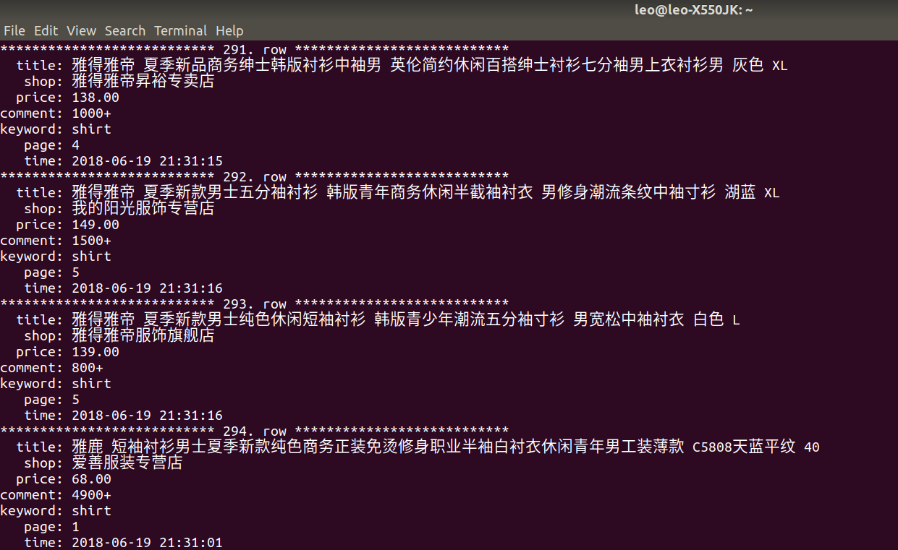

# Scrapy-redis-distributed
This project is constructed to combine multiple hosts to complete one spider task.
## 1 Preparation
Make sure to install Python3.6, Chrome, ChromeDriver, Redis and MySQL. 
Make sure to install the following libs: scrapy, scrapy-redis, selenium, redis and pymysql. 
## 2 Configuration
#### 2.1 Add scrapy-redis related parameters to settings.py
In REDIS\_URL, 'foobared' is possword to connect to Redis, '192.168.2.200' and '6379' are host and  port of Redis. 

    SCHEDULER = 'scrapy_redis.scheduler.Scheduler'
    DUPEFILTER_CLASS = 'scrapy_redis.dupefilter.RFPDupeFilter'
    REDIS_URL = 'redis://:foobared@192.168.2.200:6379'
## 3 Principles of distributed spider based on scrapy-redis
In scrapy the new Requests generated by Spider are stored in a native Request Queue. Then the Scheduler will fetch the Request and send it to Downloader for downloading. The whole task is completed on a single host. It is easy to image if we want to combine multiple hosts to participate in one spider task, the Requests should be stored in a public database which every host can access. 
Scrapy-redis makes it possible by redefining the Scheduler and Dupefilter\_Class of scrapy. In this project, the Redis server is constructed on a Linux host to store the serialized Requests. All the other hosts can push (pop) Request to (from) the public Redis server. The Dupefilter\_Class is realized to filter the duplicated Requests (the fingerprints of the Requests are also stored in the public Redis server). 
The MySQL server is built on the same Linux host to store the scraped data.
## 4 Running result
The data stored in MySQL: 

## 5 Summary
Although scrapy is asynchronous and multithreading, the efficiency of the spider is limited by the performance of the host. Scrapy-redis is used to realize ditributed spider which can greatly enhance the working efficiency since multiple hosts are combined together.